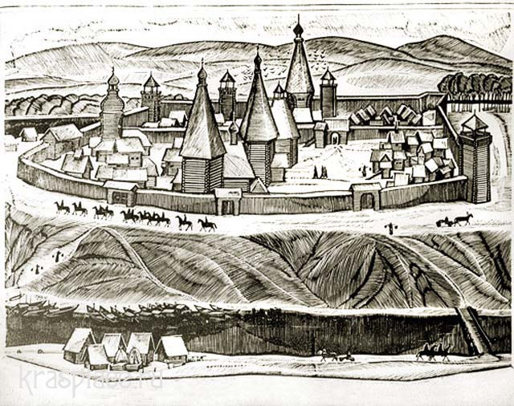
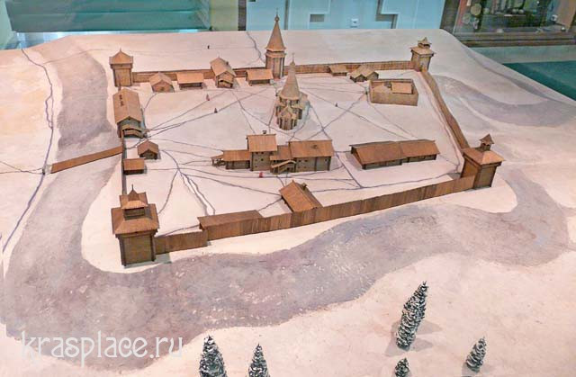
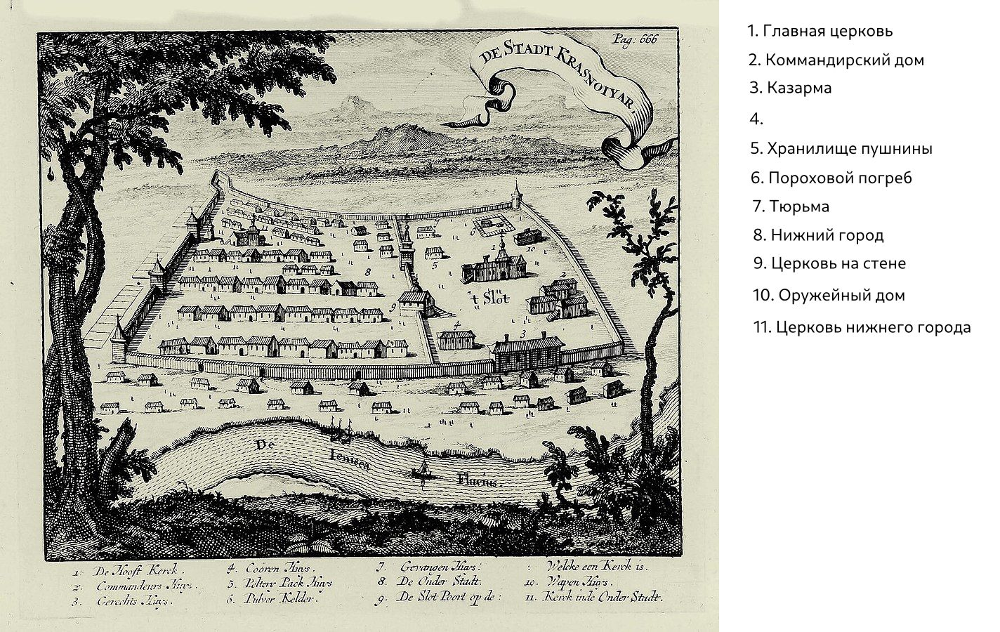

# Устье Изырсу

## Верхний Острог

### Церковь

### Дом воеводы

### Казарма

### Хранилище пушнины

### Пороховой погреб

### Оружейный дом

### Тюрьма

## Нижний Острог

### Трактир

Можно поесть, поспать, послушать бардов

### Ионесская купеческая гильдия

### Дом Прокопьевича

### Дом Кузнецовых

Лавка оружейника и кузня

### Дом Басилова (До этого пустующий)

## Часовня

### Здание часовни

### Подземная библиотека

## Слобода

### Пристань

### Поля

## Пирамида

---

# Плотина

## Пристань на Ионесском море

## Внутренности плотины

### Зал труб

### Казарма

### Кабинет Филимова

## Пристань на Ионесси

---

# Минербу

## Острог

### Оружейня

### Пороховой погреб

### Хранилище пушнины

### Казарма

## Столбы

## Столбисткий посёлок

## Кратер

Северное сияние

---

# Чёрная сопка

## Пещерная система

## Руины

## Логово разбойников

## Вулкан

---

# Рудники-26

## Деревня-26

## Шахты

## Руины

---

# Тургенсу

# 